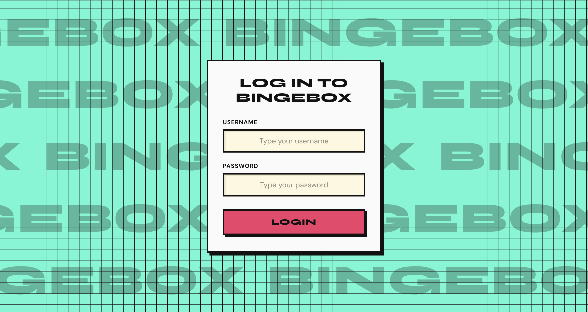
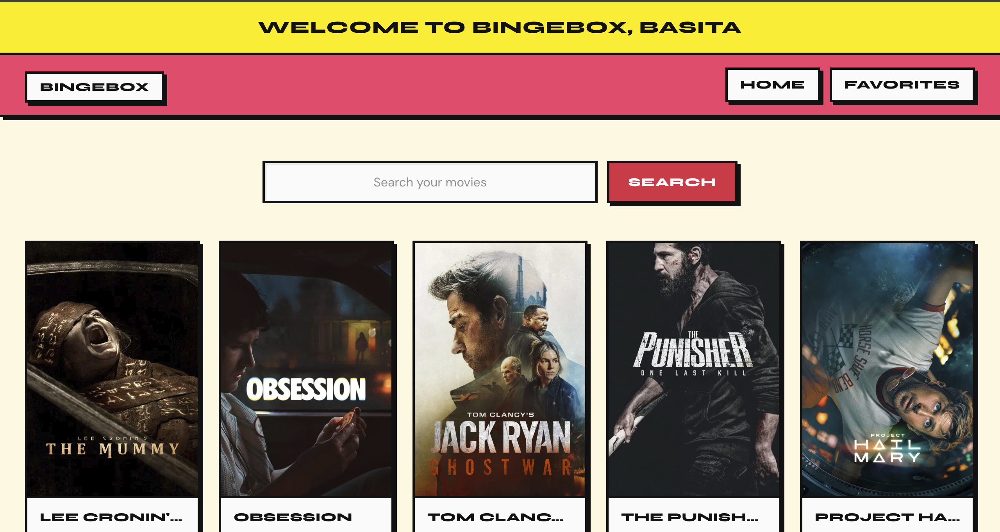
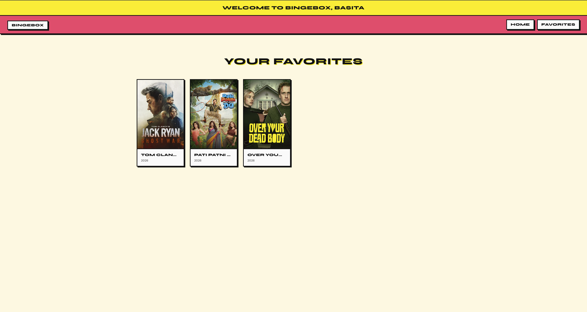
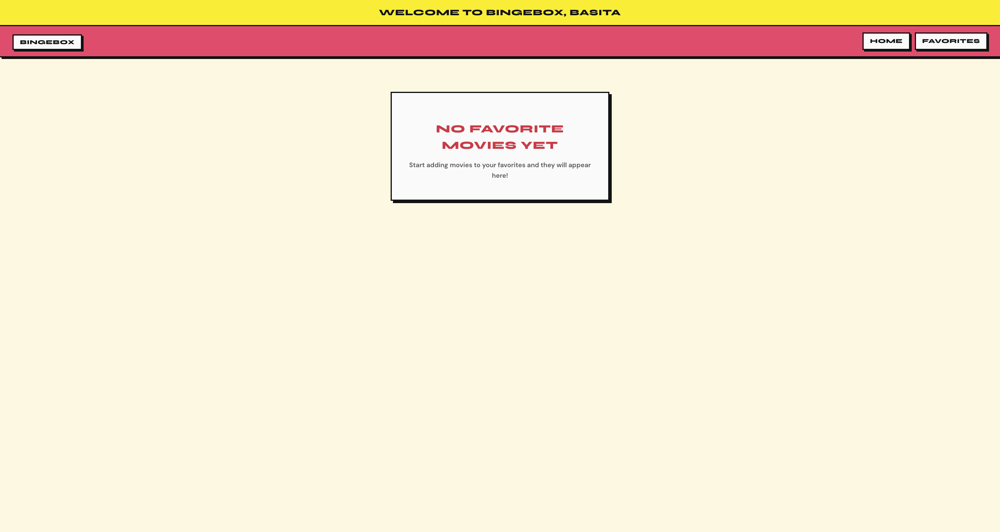

# BingeBox

BingeBox is a movie discovery web app with login protection, TMDB-powered browse/search, favorites, and full movie detail views. The UI uses a **neo-brutalism** design (bold borders, hard shadows, high-contrast colors).

<!-- Optional: add badges when published -->
<!--   -->

---

## Table of contents

- [Screenshots](#screenshots)
- [Features](#features)
- [Tech stack](#tech-stack)
- [Project structure](#project-structure)
- [Prerequisites](#prerequisites)
- [Installation](#installation)
- [Environment variables](#environment-variables)
- [Usage](#usage)
- [Routes](#routes)
- [API integration](#api-integration)
- [Available scripts](#available-scripts)
- [Security notes](#security-notes)
- [Troubleshooting](#troubleshooting)
- [Contributing](#contributing)
- [License](#license)

---

## Screenshots

Add your screenshots under `docs/` and replace the placeholders below.

### Login page

Animated **BingeBox** marquee on the background and neo-brutalism login form.

<!-- Replace with your screenshot -->



<!--
  To add: save as docs/login.png
  Alt text: BingeBox login screen with animated background
-->

### Home — popular movies

Browse popular movies from TMDB in a responsive grid.

<!-- Replace with your screenshot -->



<!--
  To add: save as docs/home.png
-->

### Search results

Search movies by title and view matching results.

<!-- Replace with your screenshot -->


<!--
  To add: save as docs/search.png
-->

### Movie details modal

Click any movie card to open full TMDB details (overview, cast, ratings, budget, and more).

<!-- Replace with your screenshot -->


<!--
  To add: save as docs/movie-details.png
-->

### Favorites page

Movies saved to favorites (persisted in `localStorage`).

<!-- Replace with your screenshot -->



<!--
  To add: save as docs/favorites.png
-->

### Empty favorites state

Shown when no movies have been favorited yet.

<!-- Replace with your screenshot -->



<!--
  To add: save as docs/favorites-empty.png
-->

---

## Features

| Feature              | Description                                                                      |
| -------------------- | -------------------------------------------------------------------------------- |
| **Authentication**   | Demo login gate; protected `/movies` routes                                      |
| **Animated login**   | “BingeBox” text scrolls left-to-right on the login background                    |
| **Popular movies**   | Loads trending/popular titles from TMDB on the home page                         |
| **Search**           | Find movies by title via TMDB search API                                         |
| **Movie details**    | Click a card to open a modal with full movie info (cast, budget, overview, etc.) |
| **Favorites**        | Add/remove favorites; stored in browser `localStorage`                           |
| **Neo-brutalism UI** | Shared design tokens, bold typography, offset shadows                            |
| **Monorepo layout**  | `frontend/` (React) + `backend/` (API module) with npm workspaces                |

---

## Tech stack

| Layer              | Technologies                                                      |
| ------------------ | ----------------------------------------------------------------- |
| **Frontend**       | React 19, React Router 7, Vite 6                                  |
| **Styling**        | Plain CSS (neo-brutalism tokens in `frontend/src/index.css`)      |
| **Data**           | [The Movie Database (TMDB)](https://www.themoviedb.org/) REST API |
| **Backend module** | ES modules (`fetch`), imported by Vite via `@backend` alias       |
| **Tooling**        | ESLint, npm workspaces                                            |

---

## Project structure

```
login-page/
├── .env                    # Local secrets (gitignored)
├── .env.example            # Environment template
├── docs/
│   └── screenshots/        # README screenshots go here
├── frontend/
│   ├── index.html
│   ├── vite.config.js
│   └── src/
│       ├── main.jsx              # React entry
│       ├── App.jsx               # Auth + top-level routes
│       ├── index.css             # Global design tokens
│       ├── components/
│       │   ├── Login.jsx         # Login form + marquee
│       │   ├── MainWebsite.jsx   # Post-login shell
│       │   └── ProtectedRoute.jsx
│       └── pages/
│           ├── Home.jsx
│           ├── Favorites.jsx
│           ├── components/
│           │   ├── MovieCard.jsx
│           │   ├── MovieDetailModal.jsx
│           │   └── NavBar.jsx
│           ├── contexts/
│           │   └── MovieContext.jsx
│           └── css/
├── backend/
│   └── src/
│       ├── config/env.js         # Reads VITE_* variables
│       └── services/api.js       # TMDB API calls
└── package.json                  # Workspace root scripts
```

---

## Prerequisites

Before you begin, ensure you have:

- [Node.js](https://nodejs.org/) **18+** (20+ recommended)
- [npm](https://www.npmjs.org/) **9+**
- A free [TMDB API key](https://www.themoviedb.org/settings/api) (v3 auth)

---

## Installation

1. **Clone the repository**

   ```bash
   git clone <your-repo-url>
   cd login-page
   ```

2. **Install dependencies**

   ```bash
   npm install
   ```

3. **Set up environment variables**

   ```bash
   cp .env.example .env
   ```

   Edit `.env` with your values (see [Environment variables](#environment-variables)).

4. **Start the development server**

   ```bash
   npm run dev
   ```

5. Open the URL printed in the terminal (usually **http://localhost:5173**).

6. Sign in with the username and password defined in your `.env` file.

---

## Environment variables

All variables live in the **project root** `.env` file. Vite loads them from `login-page/` (see `envDir` in `frontend/vite.config.js`).

| Variable             | Required | Description                                                 |
| -------------------- | -------- | ----------------------------------------------------------- |
| `VITE_TMDB_API_KEY`  | Yes      | Your TMDB API key                                           |
| `VITE_TMDB_BASE_URL` | No       | TMDB API base URL (default: `https://api.themoviedb.org/3`) |
| `VITE_DEMO_USERNAME` | Yes      | Demo login username                                         |
| `VITE_DEMO_PASSWORD` | Yes      | Demo login password                                         |

**Example `.env`:**

```env
VITE_TMDB_API_KEY=your_tmdb_api_key_here
VITE_TMDB_BASE_URL=https://api.themoviedb.org/3
VITE_DEMO_USERNAME=your_username
VITE_DEMO_PASSWORD=your_password
```

**Where they are used:**

| File                          | Purpose                          |
| ----------------------------- | -------------------------------- |
| `backend/src/config/env.js`   | Validates and exports env values |
| `backend/src/services/api.js` | TMDB requests                    |
| `frontend/src/App.jsx`        | Demo login check                 |

> Never commit `.env`. Only commit `.env.example`.

---

## Usage

### Demo login

Use the credentials from your `.env` file after starting the dev server.

### Browse & search

1. After login, you land on **Home** (`/movies`).
2. Scroll popular movies or use the search bar.
3. Click a **movie card** to open the details modal.
4. Use **♥** on a card or in the modal to save favorites.
5. Open **Favorites** in the navbar to see saved movies.

### Adding README screenshots

1. Capture screenshots while the app is running (`npm run dev`).
2. Save them in `docs/` using the filenames listed in [Screenshots](#screenshots).
3. Commit the images; the README will render them on GitHub.

| Filename              | Screen                |
| --------------------- | --------------------- |
| `login.png`           | Login page            |
| `home.png`            | Home / popular movies |
| `search.png`          | Search results        |
| `movie-details.png`   | Movie detail modal    |
| `favorites.png`       | Favorites with items  |
| `favorites-empty.png` | Empty favorites state |

---

## Routes

| Path                | Access    | Description                                             |
| ------------------- | --------- | ------------------------------------------------------- |
| `/`                 | Public    | Login (redirects to `/movies` if already authenticated) |
| `/movies`           | Protected | Home — popular movies & search                          |
| `/movies/favorites` | Protected | Saved favorites                                         |

---

## API integration

BingeBox uses the [TMDB API v3](https://developer.themoviedb.org/docs). Implemented in `backend/src/services/api.js`:

| Function              | TMDB endpoint                                | Purpose        |
| --------------------- | -------------------------------------------- | -------------- |
| `getPopularMovies()`  | `GET /movie/popular`                         | Home page grid |
| `searchMovies(query)` | `GET /search/movie`                          | Search bar     |
| `getMovieDetails(id)` | `GET /movie/{id}?append_to_response=credits` | Detail modal   |

Movie images are served from `https://image.tmdb.org/t/p/`.

---

## Available scripts

Run from the **project root** (`login-page/`):

| Command           | Description                          |
| ----------------- | ------------------------------------ |
| `npm run dev`     | Start Vite dev server with HMR       |
| `npm run build`   | Production build → `frontend/dist/`  |
| `npm run preview` | Preview the production build locally |
| `npm run lint`    | Run ESLint on the frontend           |

---

## Security notes

- This is a **client-side SPA**. Variables prefixed with `VITE_` are included in the browser bundle.
- The TMDB API key and demo login credentials are visible to anyone who inspects the built app.
- For production, use a real backend server to hold secrets and proxy TMDB requests.
- Do not commit `.env` or share API keys publicly.

---

## Troubleshooting

| Issue                                   | Solution                                                       |
| --------------------------------------- | -------------------------------------------------------------- |
| `Missing required environment variable` | Copy `.env.example` to `.env` and fill all required values     |
| Blank movie posters                     | Some TMDB entries have no poster; a placeholder is shown       |
| Movies not loading                      | Check API key, network, and TMDB rate limits                   |
| Login fails                             | Verify `VITE_DEMO_USERNAME` and `VITE_DEMO_PASSWORD` in `.env` |
| Screenshots broken in README            | Ensure files exist under `docs/` with exact filenames          |

---

## Contributing

1. Fork the repository
2. Create a feature branch (`git checkout -b feature/your-feature`)
3. Commit your changes (`git commit -m 'Add your feature'`)
4. Push to the branch (`git push origin feature/your-feature`)
5. Open a Pull Request

---

## License

This project is private. Add a license file (e.g. MIT) if you plan to open-source it.

---

## Acknowledgments

- Movie data and images provided by [The Movie Database (TMDB)](https://www.themoviedb.org/)
- This product uses the TMDB API but is not endorsed or certified by TMDB

---

**BingeBox** — log in, browse, search, and build your watchlist.
